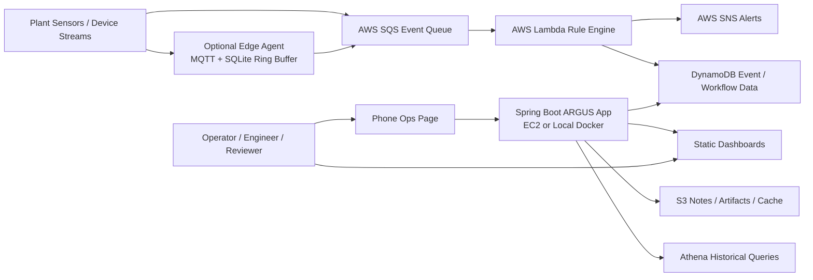
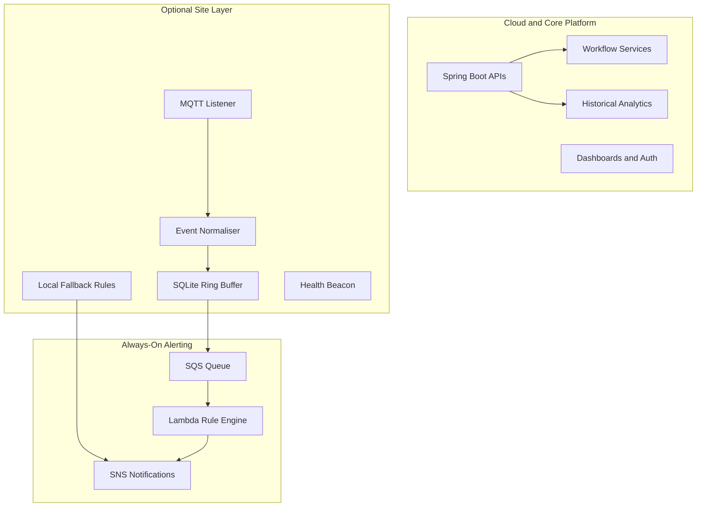

# ARGUS Project Exit, Setup, and Architecture Handover

This document is the high-level exit and handover guide for the ARGUS industrial IoT platform repository. It is written for a new developer, reviewer, interviewer, maintainer, or project owner who needs to understand what the project is, why it matters, how to run it, and where to extend it next.

Repository: `https://github.com/ARGOD2213/ARGUS`  
Local folder observed during handover: `ARGODREIGN`  
Primary runtime: Spring Boot 3.2 on Java 17  
Project mode: industrial monitoring, decision support, alert workflows, and edge-ready architecture

---

## 1. Executive Summary

ARGUS is an event-driven industrial IoT monitoring platform designed around continuous-process plant use cases such as ammonia-urea, utilities, rotating equipment, and safety-critical operations. The project combines real-time event ingestion, cloud alerting, operator dashboards, safety analytics, compliance views, and machine intelligence into a single demonstrable portfolio system.

What makes the project strong is that it is not only a backend API and not only a dashboard. It stitches together:

- live ingest and alert routing
- operator acknowledgement and escalation workflows
- machine intelligence and explainable advisory outputs
- shift handover support
- safety calculations such as NH3 exposure and fatigue scoring
- compliance reporting and CEMS visibility
- mobile start/stop operations
- optional edge buffering and offline resilience

This gives the project a shape that is much closer to what the market currently expects from modern industrial software: cloud-aware, low-cost, event-driven, cyber-conscious, and operationally usable by non-developers.

---

## 2. Why This Project Exists

Traditional plant applications are often split across many disconnected tools: historian screens, alerting utilities, email chains, handover books, spreadsheet compliance packs, and ad hoc analytics. ARGUS exists to show how those workflows can be unified into a single platform without jumping straight to expensive enterprise infrastructure.

The project is especially useful as a portfolio and handover artifact because it demonstrates:

- industrial domain understanding, not just generic CRUD
- practical cloud architecture under tight cost constraints
- safety and operational guardrails
- AI used as decision support instead of unsafe auto-control
- a path from demo-friendly software to field-ready edge expansion

---

## 3. What Was Done Exceptionally Well

This repository stands out for several reasons:

- It treats industrial safety as a first-class design concern. AI outputs are framed as advisory, not control instructions.
- It uses an event-driven rule path so alerting can stay available even when the main dashboard server is off for cost control.
- It adds operator workflows that many demo projects ignore: acknowledgement, escalation, evidence, and shift handover.
- It includes an edge-agent path with local buffering and offline fallback, which makes the architecture more realistic for plant networks.
- It keeps the front end intentionally lightweight with static HTML dashboards, which reduces build complexity and improves portability.
- It balances portfolio value with practical engineering tradeoffs: low monthly cost, visible features, and clear architectural boundaries.

---

## 4. Problem Statement and Market Relevance

Industrial teams today need more than alarm lists. They need context, prioritisation, traceability, and a way to connect operations, maintenance, safety, and compliance into one workflow. Current market demand is especially strong around:

- predictive maintenance
- edge-to-cloud architectures
- explainable industrial AI
- low-cost monitoring for brownfield facilities
- cybersecurity-conscious OT/IT separation
- evidence-driven compliance reporting

ARGUS maps well to those needs because it is already structured around:

- cloud ingestion plus serverless alerting
- dashboard experiences for different operational roles
- auditable workflow states
- optional edge deployment for poor-connectivity sites
- a modular service layer that can absorb more data sources and industry standards

---

## 5. Architecture Principles

The repository already documents key architectural decisions in `docs/adr/`. The most important principles visible in the codebase are:

- ADR-001: alert rule execution is intended to live in AWS Lambda so safety alerting is not tied to EC2 uptime
- ADR-002: no write path to the OT layer from the application
- ADR-003: generated analysis must remain advisory in tone and labeling
- ADR-004: S3 and Athena are used for historical and analytical workloads while operational event state is kept lightweight
- ADR-005: the edge layer is read-focused, locally buffered, and designed for cybersecurity separation

These principles are important because they prevent the project from drifting into unsafe or overly expensive architecture.

---

## 6. Architecture View

### 6.1 System Context Diagram



### 6.2 Runtime Responsibility Split



### 6.3 Practical Architectural Reading

In plain terms, the architecture is built in three layers:

- presentation layer: HTML dashboards and operator-facing APIs
- application layer: Spring Boot services for intelligence, safety, workflows, analytics, and compliance
- event and infrastructure layer: SQS, Lambda, SNS, S3, Athena, DynamoDB, plus the optional edge agent

This is a strong shape for an industrial platform because each layer can evolve independently without turning the repository into a monolith that is hard to reason about.

---

## 7. Key Features in the Current Repository

### 7.1 Core Platform Features

- health and platform status endpoints
- dashboard overview and live operational visibility
- machine alert lists, trends, and OEE-style metrics
- sensor ingest API
- sensor health monitoring
- weather-aware context enrichment

### 7.2 Machine Intelligence Features

- local predictive intelligence for per-machine summary scoring
- deep-dive machine analysis
- fleet watchlist view
- machine chat endpoint for operator-style questions
- named model stack for explainable intelligence positioning

### 7.3 Safety Features

- NH3 zone visibility
- fatigue scoring and worker fatigue cards
- exposure and TWA context
- permit-to-work style visibility endpoint
- zone risk scoring

### 7.4 Workflow Features

- alert acknowledgement
- alert escalation
- acknowledgement status tracking
- review, approve, and reject flow for advisory evidence
- recent advisory evidence retrieval
- shift handover summary generation
- operator note storage and note history
- timeline view for operational events

### 7.5 Compliance and Operations Features

- compliance score and summary endpoints
- sprint readiness and inspection views
- CEMS current-state visibility
- mobile/phone operations page for quick start access
- security configuration for protected dashboards and APIs

### 7.6 Edge Features

- local MQTT ingest
- canonical event normalisation
- SQLite ring buffer
- SQS forwarding
- local fallback rule evaluation
- edge health beacon

---

## 8. User-Facing Interfaces

The static web layer currently contains these major browser surfaces:

- `src/main/resources/static/index.html` - overview dashboard
- `src/main/resources/static/machine.html` - machine operations and trends
- `src/main/resources/static/intelligence.html` - machine intelligence console
- `src/main/resources/static/safety.html` - safety dashboard
- `src/main/resources/static/plant.html` - plant view
- `src/main/resources/static/compliance.html` - compliance view
- `src/main/resources/static/handover.html` - shift handover view
- `src/main/resources/static/timeline.html` - timeline view
- `src/main/resources/static/ops.html` - mobile operations page

This is one of the more portfolio-relevant parts of the project because it shows that the system is usable by operators, not only by developers testing APIs.

---

## 9. Technology Stack and Why Each Piece Was Used

| Technology | Role in ARGUS | Why it fits |
|---|---|---|
| Java 17 | main application runtime | modern LTS Java baseline for enterprise-grade services |
| Spring Boot 3.2 | API and application framework | fast backend delivery, dependency injection, security, scheduling, actuator |
| Maven | build and dependency management | standard, stable Java build tooling |
| Spring Security | dashboard and API protection | lightweight auth boundary for operator access |
| Static HTML + JS | dashboard UI | highly portable, low build overhead, easy GitHub review |
| Docker / Docker Compose | local reproducible environment | simplest way to start the stack on a new laptop |
| MySQL | local relational persistence path in current runtime config | useful for local dev and structured app state |
| Redis | low-latency cache path in current runtime config | supports responsive dashboard-style reads |
| AWS SQS | decoupled event ingestion | resilient queueing between device/event sources and rules |
| AWS Lambda | rule-engine execution path | keeps alerting available without full app uptime |
| AWS SNS | notification fanout | suitable for warning and critical alert delivery |
| AWS S3 | notes, artifacts, cached outputs | cheap object storage for documents and analytical by-products |
| AWS Athena | historical query path | useful for low-cost analytics on larger event history |
| DynamoDB | lightweight event/workflow storage | good fit for keyed operational records and low-admin workloads |
| Python 3 | Lambda and edge components | fast iteration for integration-heavy utility modules |
| SQLite | edge ring buffer | simple, robust local persistence for offline buffering |
| GitHub Actions | automation and remote control | practical for start/stop flows and CI-adjacent operations |

---

## 10. Setup and Where to Start

### 10.1 Fastest Path for a New Developer

Start in this order:

1. Read `README.md` for the current top-level positioning.
2. Read `docs/adr/ADR-001-rule-engine-lambda.md` through `docs/adr/ADR-005-edge-layer-architecture.md`.
3. Open `src/main/resources/application.properties` to understand runtime assumptions.
4. Review the controllers under `src/main/java/com/mahindra/iot/controller/`.
5. Run locally using Docker Compose or Maven.
6. Open the static dashboards and test the health endpoint first.

### 10.2 Local Run Using Docker

```bash
git clone https://github.com/ARGOD2213/ARGUS.git
cd ARGUS
cp .env.example .env
# fill AWS and API values as needed
docker compose up --build
```

Default local services defined today:

- app on port `8080`
- MySQL on port `3306` unless overridden
- Redis on port `6379` unless overridden

Useful first checks:

```bash
curl http://localhost:8080/api/v1/health
curl http://localhost:8080/api/platform/status
```

### 10.3 Local Run Using Maven

```bash
git clone https://github.com/ARGOD2213/ARGUS.git
cd ARGUS
cp .env.example .env
mvn -q -DskipTests package
java -jar target/iot-alert-engine-*.jar
```

### 10.4 Login Model

The current application security config protects most routes with HTTP Basic auth. Health and platform status are public. Credentials are wired through properties:

- `ARGUS_DASHBOARD_USER`
- `ARGUS_DASHBOARD_PASS`

Defaults in the repo currently resolve to:

- username: `argus`
- password: `changeme`

These should be treated as demo defaults only.

---

## 11. Repository Map for a New Maintainer

| Area | Path | What to look for |
|---|---|---|
| main application entry | `src/main/java/com/mahindra/iot/IotAlertEngineApplication.java` | runtime bootstrapping |
| controllers | `src/main/java/com/mahindra/iot/controller/` | exposed APIs and feature surfaces |
| business services | `src/main/java/com/mahindra/iot/service/` | most feature logic lives here |
| configuration | `src/main/java/com/mahindra/iot/config/` | AWS, cache, security, thresholds |
| AI/advisory helper | `src/main/java/com/mahindra/iot/util/AiAdvisoryWrapper.java` | advisory labeling and safety framing |
| dashboards | `src/main/resources/static/` | browser UI surfaces |
| runtime properties | `src/main/resources/application.properties` | environment bindings and defaults |
| Lambda rule engine | `lambda/rule_engine/` | event-driven threshold path |
| Lambda ops control | `lambda/ops_control/` | phone-oriented control plane |
| edge agent | `edge/agent/` | offline and plant-side integration path |
| ADRs and sprint docs | `docs/` | project reasoning, evidence, and handover material |
| scripts | `scripts/` | deployment, bootstrap, and operational utilities |

---

## 12. Feature-to-Business Value Mapping

| Feature | Business value |
|---|---|
| event-driven alerting | faster detection and decoupled response path |
| operator acknowledgement and escalation | closes the loop after an alert instead of leaving it as passive telemetry |
| shift handover notes | preserves knowledge between operators and shifts |
| machine intelligence summaries | reduces time needed to interpret abnormal trends |
| fleet watchlist | helps maintenance teams prioritise assets |
| safety analytics | adds worker and process context, not just equipment context |
| compliance views | improves audit readiness and evidence packaging |
| edge buffering | preserves resilience when cloud connectivity is weak |
| mobile operations page | lowers demo friction and improves operator accessibility |

---

## 13. Architectural Strengths

The most reusable strengths of this design are:

- clear separation between event ingestion, decision logic, dashboards, and storage
- serverless-friendly alert path
- optional edge extension without redesigning the whole platform
- static UI surfaces that are easy to host and easy to review
- enough modularity to add new plant domains without rewriting the foundation

Because of that, the architecture is not locked to one demo use case. It can grow into a broader platform.

---

## 14. What Else Can Be Built on This Architecture

With the current structure, the following expansions are realistic:

- OPC-UA or Modbus connectors for live industrial equipment integration
- historian replay and event backfill pipelines
- multi-site command center with facility-level rollups
- predictive maintenance workbench with failure mode trending
- permit-to-work workflow hardening with approvals and digital signatures
- inspection management and audit trail products
- environmental compliance reporting packs
- mobile incident response workflows
- role-based reviewer workflows for safety-critical advisory signoff
- customer-facing SaaS version for small and mid-sized plants

In other words, the current repository is not only a finished demo. It is also a strong seed architecture for:

- industrial observability platform
- predictive maintenance product
- safety operations cockpit
- compliance evidence platform
- edge-to-cloud manufacturing analytics suite

---

## 15. Handover Risks and Realistic Notes

This section is intentionally honest so the next developer starts from reality:

- The repo shows both current local-stack dependencies such as MySQL and Redis and broader target-architecture documents around Lambda, DynamoDB, S3, and Athena. A new maintainer should treat the repository as a live platform with evolving architecture, not a fully finalised product.
- There is already an older handover guide in `docs/ARGODREIGN_Exit_Handover_Guide.md`. This document should be considered the architecture-first handover companion to that file.
- Protected routes rely on basic auth defaults unless environment variables are overridden. This is acceptable for demo use, not production.
- Some sprint and roadmap documentation is aspirational in tone. Always compare docs against the actual source tree before claiming a feature is complete.

---

## 16. Recommended First Week for the Next Developer

1. Run the app locally and confirm health, overview, and one dashboard.
2. Walk through the controller layer and map each endpoint to its service.
3. Review the ADRs and align them with the current implementation.
4. Test one end-to-end alert flow from ingest to acknowledgement.
5. Review the edge agent and Lambda code to understand the event path.
6. Decide which architecture is the immediate source of truth for the next sprint: current local stack, cloud-first stack, or edge-first integration.

---

## 17. Final Handover Summary

ARGUS is a strong industrial software portfolio project because it demonstrates system thinking, not isolated features. It blends event-driven cloud services, operator workflows, safety context, explainable intelligence, and edge readiness in a way that is both practical and market-relevant.

If a new developer asks where to begin, the answer is:

- start with the ADRs
- run the project locally
- understand the controller and service boundaries
- trace one alert from input to operator workflow
- then choose the next expansion path from cloud, edge, compliance, or predictive intelligence

That makes this repository suitable not only for handover, but also for interviews, demos, architecture discussions, and future productisation.
